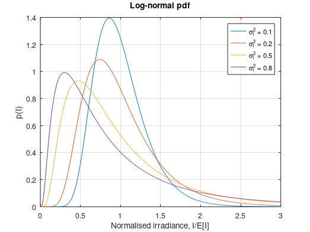
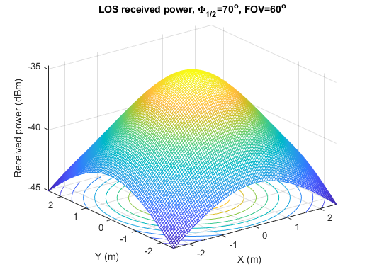
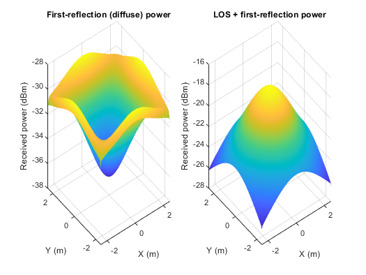

| Name                     | Description                    |
| ------------------------ | ------------------------------ |
| `CORRECT_plot_Fig3p28.m` | the log-normal pdf             |
| `CORRECT_plot_Fig3p31.m` | the gamma-gamma pdf            |
| `program_3p1.m`          | calculate the LOS channel gain |
| `NEEDFIX_program_3p2.m`  | optical power distribution in a diffuse channel (incomplete, very slow) |
| `program_3p5.m`          | simulation of Kim’s model      |

### Fixed versions (see [../FIXES.md](../FIXES.md))

| Name                     | Description                    |
| ------------------------ | ------------------------------ |
| `FIXED_plot_Fig3p28.m`   | log-normal pdf (no NaN at I = 0, σ_l² legend) |
| `FIXED_program_3p1.m`    | LOS channel gain / received power; concentrator gain n²/sin²(FOV), FOV test |
| `FIXED_program_3p2.m`    | LOS + first-reflection power distribution, all four walls, vectorised |

### Simulation results

Figures produced by the `FIXED_*` scripts (see [`docs/figures`](../docs/figures)).

*`FIXED_plot_Fig3p28.m`: Log-normal irradiance pdf for several log-irradiance variances σ_l².*

*`FIXED_program_3p1.m`: LOS received power over the receiving plane (concentrator gain n²/sin²FOV, FOV cut-off).*

*`FIXED_program_3p2.m`: First-reflection (left) and LOS + first-reflection (right) received power, all four walls.*
