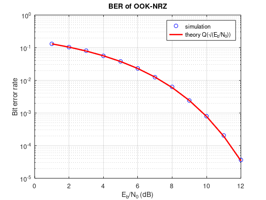
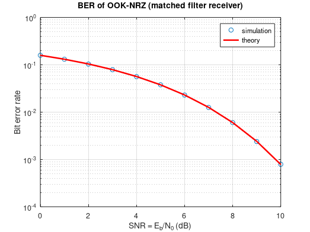
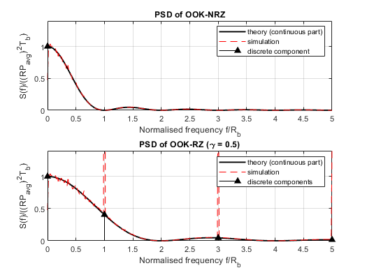
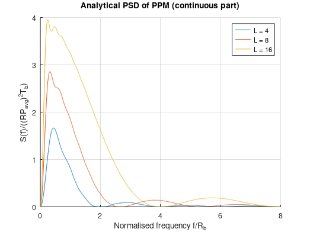
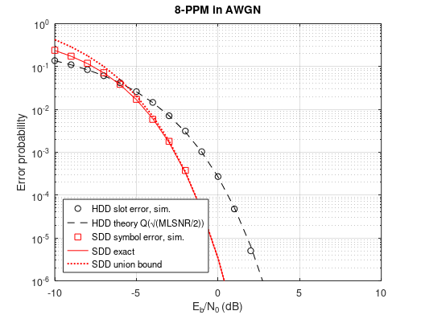
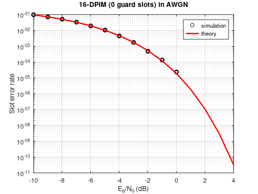
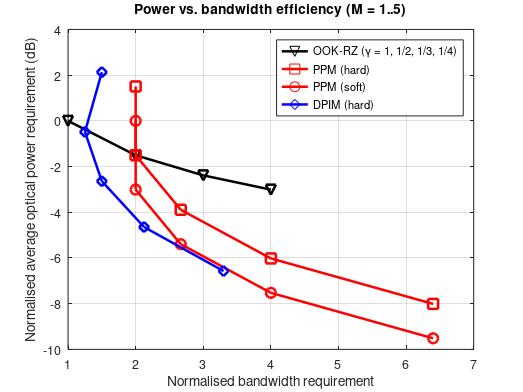
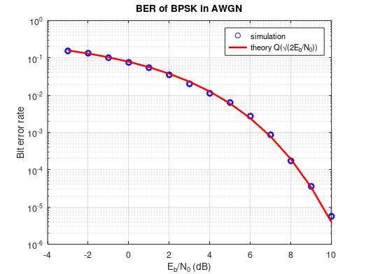
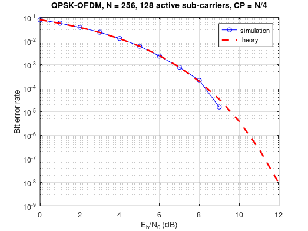
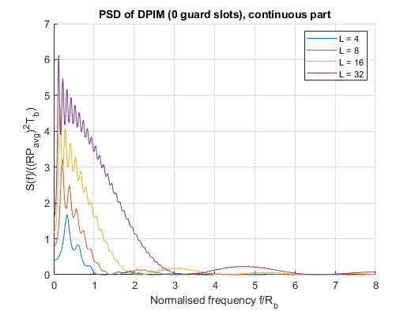

| Name                     | Description                                           |
| ------------------------ | ----------------------------------------------------- |
| `CORRECT_plot_Fig4p13.m` | calculate PSD of DPIM(0GS)                            |
| `CORRECT_program_4p4.m`  | simulate BER of OOK-NRZ                               |
| `CORRECT_program_4p5.m`  | simulate BER of OOK-NRZ using matched filter–based Rx |
| `CORRECT_program_4p7.m`  | calculate the analytical PSD of PPM                   |
| `program_4p11.m`         | simulate SER of DPIM in AWGN channel                  |

### Fixed versions (see [../FIXES.md](../FIXES.md))

| Name                     | Description                                           |
| ------------------------ | ----------------------------------------------------- |
| `FIXED_program_4p4.m`    | BER of OOK-NRZ, sample-level simulation vs Q(√(Eb/N0)) |
| `FIXED_program_4p5.m`    | BER of OOK-NRZ, matched-filter-output simulation vs theory |
| `FIXED_plot_Fig4p5.m`    | PSD of OOK-NRZ / OOK-RZ, analytical (corrected ×1/4) and simulated |
| `FIXED_program_4p7.m`    | analytical PSD of PPM with M = log2(L)                |
| `FIXED_program_4p8.m`    | PPM hard/soft decision: simulation + theory           |
| `FIXED_program_4p11.m`   | DPIM slot error rate in AWGN                          |
| `FIXED_program_4p12.m`   | power vs bandwidth efficiency (legend fixed)          |
| `FIXED_program_4p13.m`   | BER of BPSK in AWGN (undefined variable fixed)        |
| `FIXED_program_4p14.m`   | QPSK-OFDM BER, AWGN or multipath + ZF equaliser       |
| `FIXED_plot_Fig4p13.m`   | normalised PSD of DPIM (0 guard slots)                |

### Simulation results

Figures produced by the `FIXED_*` scripts (see [`docs/figures`](../docs/figures)).

*`FIXED_program_4p4.m`: OOK-NRZ BER: simulation matches Q(√(Eb/N0)).*

*`FIXED_program_4p5.m`: OOK-NRZ BER with a matched-filter receiver: simulation vs theory.*

*`FIXED_plot_Fig4p5.m`: PSD of OOK-NRZ and OOK-RZ (γ = 0.5): analytical and simulated.*

*`FIXED_program_4p7.m`: Analytical PSD of L-PPM (continuous part) with M = log2 L.*

*`FIXED_program_4p8.m`: PPM in AWGN: hard- and soft-decision error rates, simulation vs theory.*

*`FIXED_program_4p11.m`: DPIM slot error rate in AWGN: simulation vs theory.*

*`FIXED_program_4p12.m`: Power vs bandwidth requirement of OOK-RZ, PPM and DPIM, normalised to OOK-NRZ.*

*`FIXED_program_4p13.m`: BPSK BER in AWGN: simulation matches Q(√(2Eb/N0)).*

*`FIXED_program_4p14.m`: QPSK-OFDM BER in AWGN: simulation vs theory.*

*`FIXED_plot_Fig4p13.m`: Normalised PSD of DPIM with no guard slots (continuous part).*
