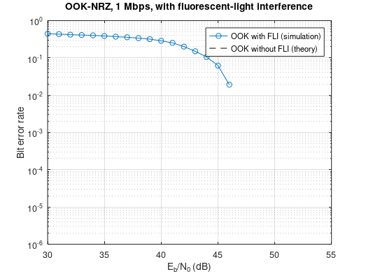
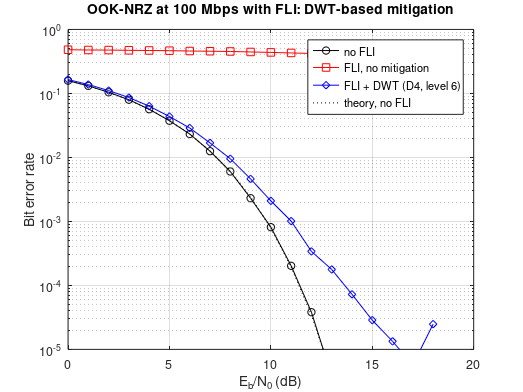
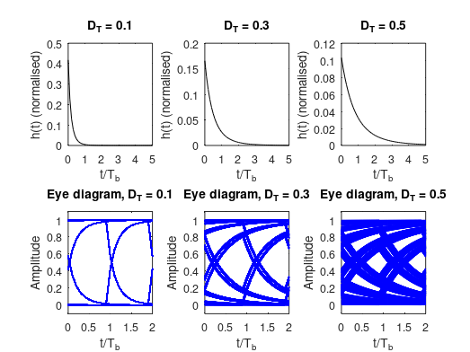
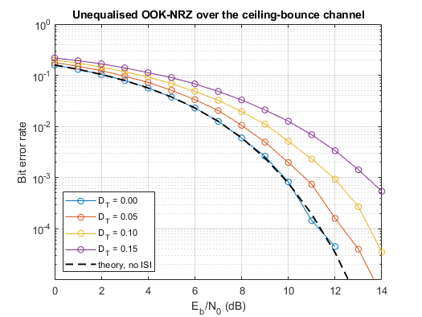
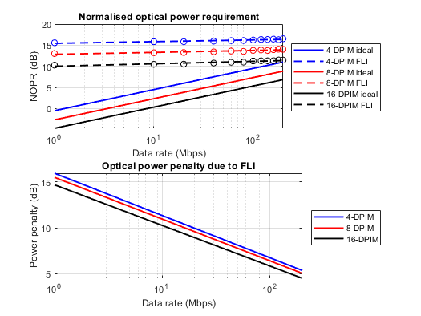
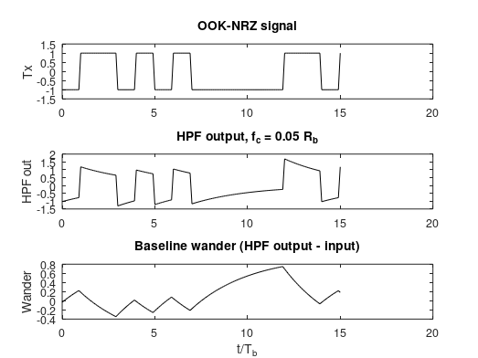
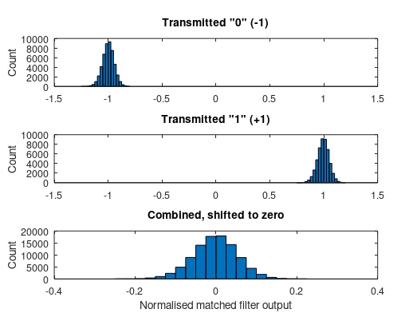

| Name                    | Description                                                  |
| ----------------------- | ------------------------------------------------------------ |
| `CORRECT_plot_Fig5p7.m` | slow the effect of high-pass filter and baseline wander in OOK-NRZ signal. |
| `program_5p6.m`         | simulate ceiling bounce model and received signal eye diagram |
| `program_5p1.m`         | simulate effect of FLI on OOK, plot BER vs E_b/N_0 for OOK with FLI |

### Fixed versions (see [../FIXES.md](../FIXES.md))

| Name                     | Description                                                  |
| ------------------------ | ------------------------------------------------------------ |
| `FIXED_program_5p1.m`    | BER of OOK with fluorescent-light interference (index error fixed) |
| `FIXED_program_5p5.m`    | DWT-based FLI mitigation: BER without FLI / with FLI / with FLI + DWT |
| `FIXED_program_5p6.m`    | ceiling-bounce impulse responses and eye diagrams for several D_T |
| `FIXED_demo_Fig5p38.m`   | BER of unequalised OOK over the ceiling-bounce channel |
| `FIXED_plot_Fig5p6.m`    | NOPR of DPIM vs data rate, ideal and FLI channel, power penalty |
| `FIXED_plot_Fig5p7.m`    | HPF baseline wander on OOK-NRZ |
| `FIXED_plot_Fig5p8.m`    | matched-filter output histograms with baseline wander |

### Simulation results

Figures produced by the `FIXED_*` scripts (see [`docs/figures`](../docs/figures)).

*`FIXED_program_5p1.m`: OOK-NRZ at 1 Mbps: BER with fluorescent-light interference vs the FLI-free theory.*

*`FIXED_program_5p5.m`: OOK-NRZ at 100 Mbps: BER without FLI, with FLI, and with FLI + DWT mitigation.*

*`FIXED_program_5p6.m`: Ceiling-bounce impulse responses and eye diagrams for several delay spreads D_T.*

*`FIXED_demo_Fig5p38.m`: BER of unequalised OOK-NRZ over the ceiling-bounce channel for several D_T.*

*`FIXED_plot_Fig5p6.m`: DPIM normalised optical power requirement vs data rate, and the FLI power penalty.*

*`FIXED_plot_Fig5p7.m`: Baseline wander of OOK-NRZ caused by a high-pass filter.*

*`FIXED_plot_Fig5p8.m`: Matched-filter output histograms with baseline wander.*
