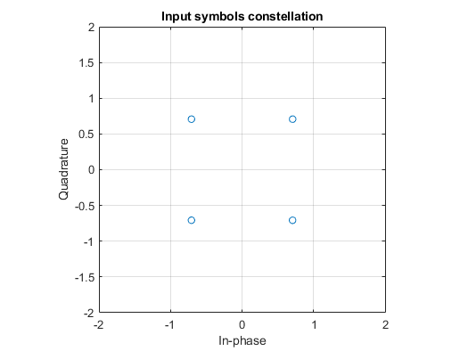
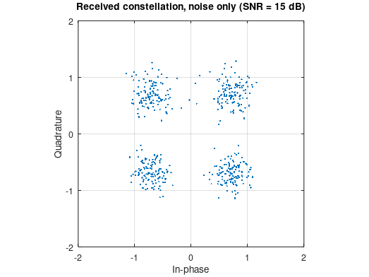
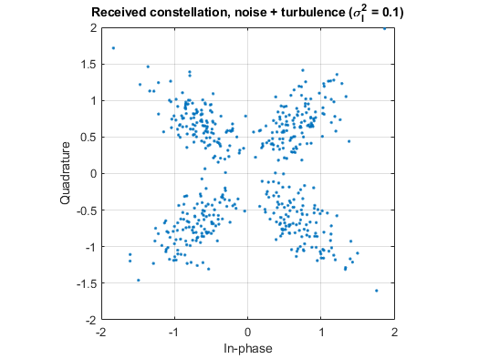
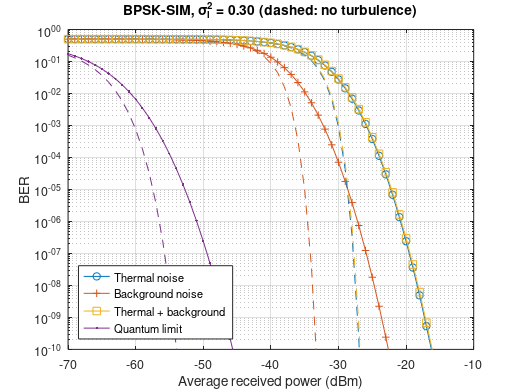
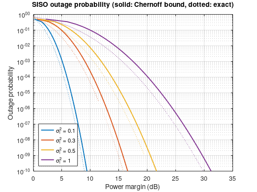
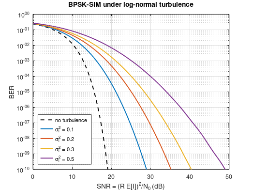

| Name                     | Description                                                  |
| ------------------------ | ------------------------------------------------------------ |
| `CORRECT_plot_Fig6p10_Fig6p11_Fig6p12.m` | QPSK constellation of the input subcarrier signal without the noise fading, etc. |
| `CORRECT_plot_Fig6p19.m`                 | Outage probability against the power margin for a log-normal turbulent atmospheric channel for $\sigma_l^2=[0.1, 0.3, 0.5, 1]$ |

### Fixed versions (see [../FIXES.md](../FIXES.md))

| Name                     | Description                                                  |
| ------------------------ | ------------------------------------------------------------ |
| `FIXED_plot_Fig6p7.m`    | BER of BPPM + APD vs scintillation index (GH weight typo, loop index, missing √ fixed) |
| `FIXED_plot_Fig6p10_Fig6p11_Fig6p12.m` | QPSK-SIM constellations: input, noise, noise + turbulence |
| `FIXED_plot_Fig6p14.m`   | BPSK-SIM BER vs received power for quantum/thermal/background limits |
| `FIXED_plot_Fig6p19.m`   | outage probability vs power margin (dB), Chernoff bound and exact |
| `FIXED_plot_Fig6p24.m`   | BPSK-SIM BER vs SNR for several σ_l² |

### Simulation results

Figures produced by the `FIXED_*` scripts (see [`docs/figures`](../docs/figures)).

*`FIXED_plot_Fig6p7.m`: BPPM with an APD receiver: BER vs scintillation index for several K_s.*

*`FIXED_plot_Fig6p10_Fig6p11_Fig6p12.m`: Fig. 6.10: QPSK-SIM input constellation.*

*`FIXED_plot_Fig6p10_Fig6p11_Fig6p12.m`: Fig. 6.11: received constellation, noise only.*

*`FIXED_plot_Fig6p10_Fig6p11_Fig6p12.m`: Fig. 6.12: received constellation, noise + turbulence.*

*`FIXED_plot_Fig6p14.m`: BPSK-SIM BER vs received power in quantum-, thermal- and background-limited regimes.*

*`FIXED_plot_Fig6p19.m`: Outage probability vs power margin: Chernoff bound and exact.*

*`FIXED_plot_Fig6p24.m`: BPSK-SIM BER vs SNR under log-normal turbulence for several σ_l².*
