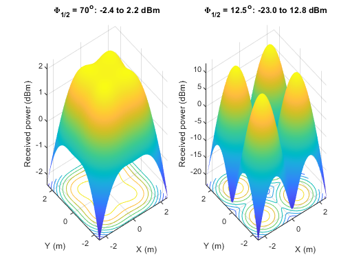
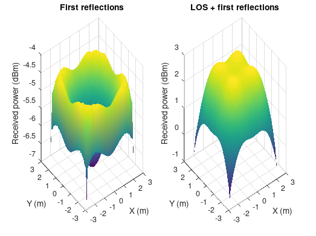
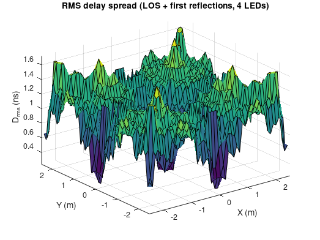
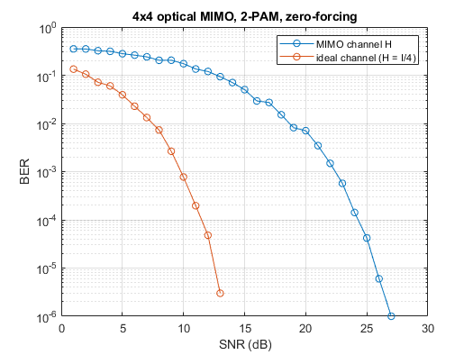

| Name                     | Description                                                  |
| ------------------------ | ------------------------------------------------------------ |
| `CORRECT_plot_Fig8p10.m` | Program 8.1: Matlab codes to calculate the optical power distribution of a LOS link at the receiving plane for a typical room. for semi-angle at half power`theta=70` and `theta=12.5` |
| `NEO_program_8p4.m` | Program 8.4: Matlab codes to simulate the MIMO system. plot BER versus SNR |

### Fixed versions (see [../FIXES.md](../FIXES.md))

| Name                     | Description                                                  |
| ------------------------ | ------------------------------------------------------------ |
| `FIXED_plot_Fig8p10.m`   | LOS power distribution for Φ½ = 70° and 12.5° (both cases) |
| `FIXED_plot_Fig8p14.m`   | first-reflection and total power distribution, 4 LEDs × 4 walls |
| `FIXED_program_8p3.m`    | RMS delay spread over the receiving plane, all TX and walls |
| `FIXED_program_8p4.m`    | 4x4 optical MIMO BER (bit count fixed), toolbox-free |

### Simulation results

Figures produced by the `FIXED_*` scripts (see [`docs/figures`](../docs/figures)).

*`FIXED_plot_Fig8p10.m`: LOS received power over the receiving plane for Φ½ = 70° and 12.5°.*

*`FIXED_plot_Fig8p14.m`: First-reflection and total received power, four LEDs and four walls.*

*`FIXED_program_8p3.m`: RMS delay spread over the receiving plane (LOS + first reflections).*

*`FIXED_program_8p4.m`: 4×4 optical MIMO with PAM and ZF detection: BER vs SNR, MIMO channel H vs ideal channel.*
