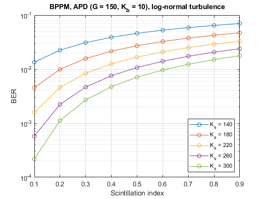

# OWC-MATLAB-Fixed

Corrected, toolbox-free companion code for the book
*Optical Wireless Communications: System and Channel Modelling with MATLAB*
(Ghassemlooy, Popoola, Rajbhandari).

Many of the book's scripts contain bugs: wrong formulas, undefined variables,
dummy values, index errors, swapped legends and APIs that no longer exist in
MATLAB. Every script with a problem has a **new** corrected companion file
`ChapterX/FIXED_<name>.m`; the original scripts are kept unchanged for comparison.

* **[FIXES.md](FIXES.md)** lists every bug found and how it was fixed.
* The `FIXED_*` scripts need **no MATLAB toolbox** and also run in **GNU Octave**.
  Toolbox functions are replaced by small helpers in `util/owc_*.m`.
* Wherever the book gives an analytical result, the fixed scripts plot the
  simulation **and** the theory, so the model can be checked at a glance.
* All 29 `FIXED_*` scripts run in MATLAB R2024a and GNU Octave 8.4.

## Results

Each chapter README shows the figures of its fixed scripts, with a caption:
[Chapter 3](Chapter3/README.md) (channel modelling) ·
[Chapter 4](Chapter4/README.md) (modulation) ·
[Chapter 5](Chapter5/README.md) (artificial-light interference, diffuse channels) ·
[Chapter 6](Chapter6/README.md) (FSO under turbulence) ·
[Chapter 8](Chapter8/README.md) (indoor VLC).
All images are in [`docs/figures`](docs/figures).

| | |
| --- | --- |
|  |  |
| OOK-NRZ BER: simulation vs Q(√(Eb/N0)) | L-PPM hard/soft decision: simulation vs theory |
|  |  |
| DWT-based mitigation of fluorescent-light interference | BPPM with APD receiver under log-normal turbulence |

## Requirements

* `FIXED_*` scripts: any recent MATLAB **without toolboxes**, or GNU Octave ≥ 6.
* Original scripts: MATLAB (tested with R2024a); several need the Communications,
  Signal Processing or Wavelet Toolbox, and some do not run at all (see FIXES.md).

## Usage

The `FIXED_*` scripts add `util/` to the path themselves; just run them:

```matlab
run('Chapter4/FIXED_program_4p4.m')
run_all_fixed                        % run every FIXED_* script and print a summary
run_all_fixed('Chapter5/FIXED_*')    % run a subset
run_all_fixed('', 'docs/figures')    % ... and save all figures as PNG
run_all_fixed('', '/tmp/owc_figs')   % the figure directory may be absolute
```

Self-checks of the helper functions:

```matlab
cd util; test_owc_utils
```

GNU Octave on a headless Linux machine:

```bash
sudo apt-get install -y octave xvfb
xvfb-run -a octave --no-gui --eval "graphics_toolkit('qt'); run_all_fixed('', '/tmp/owc_figs')"
```

The figures in `docs/figures` are generated with MATLAB.

For the original scripts, add `util/` to the MATLAB path first:

```matlab
addpath('path/to/util');
```

Units (as in the book): LED optical powers are given in **mW**, so
`10*log10(P)` is directly in **dBm**.

## Directory structure

- `Chapter3/` … `Chapter8/`: scripts per book chapter (originals + `FIXED_*`),
  each with a `README.md` listing the scripts and showing the results.
- `util/`: helper functions. `owc_*.m` are the corrected, toolbox-free helpers;
  `test_owc_utils.m` checks them. The other files are the book's originals.
- `run_all_fixed.m`: runs every `FIXED_*` script (optionally saving figures).
- `FIXES.md`: list of bugs and fixes.
- `docs/figures/`: output of the fixed scripts.

## Selected scripts

| Script | Description |
| --- | --- |
| `Chapter3/FIXED_program_3p2.m` | Program 3.2: LOS + first-reflection power distribution, all four walls |
| `Chapter4/FIXED_program_4p4.m` | Program 4.4: BER of OOK-NRZ, simulation vs theory |
| `Chapter4/FIXED_program_4p8.m` | Program 4.8: L-PPM with hard- and soft-decision decoding |
| `Chapter4/FIXED_plot_Fig4p13.m` | Program 4.10: PSD of DPIM (0 guard slots) |
| `Chapter5/FIXED_program_5p1.m` | Program 5.1: BER of OOK with fluorescent-light interference |
| `Chapter5/FIXED_program_5p5.m` | Program 5.5: DWT-based mitigation of fluorescent-light interference |
| `Chapter6/FIXED_plot_Fig6p7.m` | BER of BPPM FSO with APD receiver under log-normal turbulence |
| `Chapter8/FIXED_program_8p3.m` | Program 8.3: RMS delay spread over the receiving plane, 4 LEDs × 4 walls |
| `Chapter8/FIXED_program_8p4.m` | Program 8.4: 4×4 optical MIMO with PAM and zero-forcing detection |

The full list is in each chapter's README.

## Contributing

Issues and pull requests are welcome: bug reports against the book's code,
further fixes, or additional chapters.

## Acknowledgements

Based on the code accompanying *Optical Wireless Communications: System and
Channel Modelling with MATLAB* and on the repository
[AcraeaTerpsicore/Optical-Wireless-Communications-System-and-Channel-Modelling-with-MATLAB](https://github.com/AcraeaTerpsicore/Optical-Wireless-Communications-System-and-Channel-Modelling-with-MATLAB).
Thanks to the authors of the book and of the original code.
